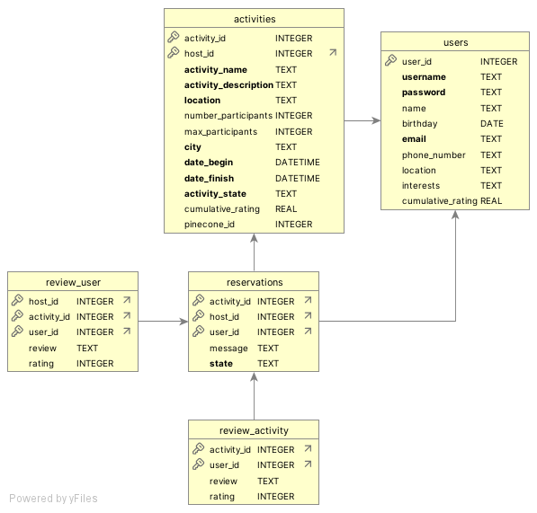

# BeAlive

This README.md is designed to provide a clear and structured guide to understand AIventure. It provides a comprehensive overview of the project functionalities, setup process and testing methodology so that team members and future contributors can easily understand, maintain and extend AIventure.

The document outlines the following sections:

**0. Repository Structure:** How the repository is organized.

**1. Project Overview:** A description of BeALive, AIventure and their purpose.

**2. How to Test the Chatbot:** The needed prerequisites to run the chatbot and how to run it.

**3. Database Schema:** An overview of the database and schema design.

**4. User Intentions:** The intentions that were implemented and how to test them.

**5. Intention Router:** A description of how the intention router and the semantic router work and the post-processing techniques used to improve accuracy.

**6. Intention Router Accuracy Testing Results:** Demonstrates router accuracy in identifying user intentions with metrics reported for each intention and the final results.

**7. Webpage Description:** Show the content of each webpage.

**8. Code Implementation:** Important notes to help in case of further code development.

## 0. Repository Structure

```plaintext
 root/
├── .streamlit/
│   └── config.toml           # Streamlit configuration file.
├── images/                   # Folder with images.
│   ├── Logo.jpeg             # Company Logo.
│   └── DB_SCHEMA.png         # Image of the database schema.
├── .gitignore                # Default ignore file.
├── app.py                    # Main streamlit application script.
├── README.md                 # Comprehensive project documentation.
├── requirements.txt          # Python dependencies.
├── BeAlive/
│   ├── chatbot/
│   │   ├──bot.py             # Core chatbot logic.
│   │   ├── agents/           # Agents 
│   │   │   └── *.py          # Agents to give reviews, check information and reservations.
│   │   ├── chains/           # Custom Langchain chains.
│   │   │   └── *.py          # Chain modules.
│   │   ├── router/           # Router and training scripts.
│   │   │   ├── *.py          # Router development.
│   │   │   └── *.ipynb       # Generating synthetic data and training and evaluating the router.
│   │   ├── tools/            # Utility tools for tasks.
│   │   │   └── *.py          # Utility scripts.
│   ├── data/
│   │   ├── loader.py         # loading data auxiliary functions.
│   │   ├── database/         # Database-related files.
│   │   │   ├── *.db          # SQLite database file.
│   │   │   └── *.ipynb       # Scripts for database creation.
│   │   ├── pdfs/             # PDFs folder (empty).
│   │   │   ├── *.pdf         # Files with company information, chatbot and webpage.
│   │   │   ├── *.py          # Script for generating embeddings.
│   │   │   ├── *.ipynb       # PDF processing scripts.
│   │   │   ├── activity form/ # Folder with the activity form.
│   │   │   │     └── *.pdf   # PDFs to generate the activities.
│   ├── pages/                #  Streamlit pages folder.
│   │   ├── *.py              # Streamlit pages scripts.

```

## 1. Project Overview

- **Company Name**: BeAlive
- **Group 1**: Dinis Fernandes, Dinis Gaspar, Inês Santos, Luis Dávila and Sara Ferrer.
- **Description**:  
  BeAlive aims to revolutionize activity-finder platforms, providing intelligent and personalized activity recommendations that resonate with user's unique preferences and current context.
  
  The user will find activities to do in their free time by interacting with our intuitive, real time conversational AI assistant, AIventure. 

  AIventure analyzes user profiles and current available activities and dynamically adjusts suggestions, helping people to discover relevant, enriched and fulfilling activities to do. AIventure also allows users to create, delete and manage activities, change their state and access ratings and reviews of their activities.
  
  Users can also learn more about BeAlive through AIventure.

---

## 2. How to Test the Chatbot

### 2.1 Prerequisites

- **Python Version**: 3.12.7
- All required libraries and frameworks are listed in the requirements.txt file.

**Environment Setup**:

To setup a conda environment you will need to:
1. Open the Anaconda Prompt;
2. Type conda create --name Group1 python==3.12.7, to create the environment, with Group1 being the name of the environment;
3. Type conda activate Group1 to activate the environment;
4. Navigate to where you have the requirements.txt file, using cd and the path to the file;
5. Type pip install -r requirements.txt, to install all required libraries;
6. Open VSCode, choose the project directory and select the correct environment.

### 2.2 How to Run the Chatbot

To lauch AIventure you will need to:
1. Open VSCode, choose the project directory and run the following command on the terminal: python -m streamlit run app.py. This will direct you to a local webpage;
2. In the webpage, go to the Login page and use the following credentials: username: Tiago, password: tiago;
3. Go to the Chatbot page and interact with AIventure.

To register a new user you will need to: 
1. Open VSCode, choose the project directory and run the following command on the terminal: python -m streamlit run app.py. This will direct you to a local webpage;
2. In the webpage, go to the Registration page and insert the necessary information, a new user will then be created.
3. To check if the new user was correctly registred, go to the Login page and login with the credentials you just created.

## 3. Database Schema

### 3.1 Database Overview and Schema Diagram

The database used by the chatbot was designed to manage user-host activities, reservations and reviews. It consists of five interconnected tables: **users**, **activities**, **reservations**, **review_user** and **review_activity**. 



These tables support the following functionalities: user registration, activity creation, reservation tracking and reviews collection. The **users** table is the core of the database. The **activities** table is then connected to the previous table through the host of an activity and the **reservations** table is also connected to **users** through the participants of the activity in question. The **review_user** and **review_activity** tables are connected to **reservations**, the first through the host and the activity and the second through the participants and the activity. This schema ensures that the system is able to handle complex interactions while maintaining data integrity.

### 3.2 Table Descriptions

- **users**: This table stores all the information needed from a user to allow personalized recommendations and contacts points. It is composed by ten columns:
  - user_id: It is the unique identifier of an user. It is an integer and a primary key.
  - username: The username to login in the website. It is of type text, it needs to have less than ten characters, it can not be null and it needs to be unique for each user.
  - password: The password to login in the website. It is of type text, it needs to have less than ten characters and it can not be null.
  - name: The name of the user. It is of type text and not mandatory.
  - birthday: The birthday of the user. It is of type date and not mandatory.
  - email: The email of the user. It is of type text, it needs to be unique and it is a mandatory field.
  - phone_number: The phone number of the user. It is of type text and not mandatory.
  - location: Where the user lives. It is of type text and not mandatory.
  - interests: The interests of the user. It is of type text and not mandatory.
  - cumulative_rating: The rating of the user. It is a real value and has a default value of zero.

- **activities**: This table ensures that information regarding activities can be easily shown to users when making recommendations. It is composed by twelve columns:
  - activity_id: It is the unique identifier of an activity. It is an integer and a primary key.
  - host_id: It is the unique identifier of an host. It is an integer and a foreign key that refers to a user_id in the users table.
  - activity_name: The name of the activity. It is of type text and is mandatory.
  - activity_description: A brief description of the activity. It is of type text and is mandatory.
  - location: Where the activity will happen. It is of type text and is mandatory.
  - number_of_participants: How many participants the activity has. It is integer value and not mandatory.
  - max_participants: The maximum number of participants. It is integer value and not mandatory.
  - city: The specific address of where the activity will happen. It is of type text and is mandatory.
  - data_begin: The date of the begining of the activity. It is of type date and is mandatory.
  - data_finish: The date of the ending of the activity. It is of type date and is mandatory.
  - activity_state: Provides information on the state of the activity. It is of type text, is mandatory and needs to be one of the following options: open, full or finished.
  - cumulative_rating: The rating of the activity. It is a real value and has a default value of zero.
  - pinecone_id: A reference ID for external use. It is an integer value and not mandatory.

- **reservations**: It is the center of the platform. It allows users to send requests to join in activities and therefore, gives the host the oportunity to filter their activity participants. It is a link between user and activities. This table is also necessary so that users can review the activities and the hosts can review the participants, while making sure that reviews are only accepted if they are about or made by an user that attended a certain activity. It is composed by five columns:
  - activity_id: It is the unique identifier of an activity. It is an integer and a foreign key that refers to activity_id in the activities table.
  - host_id: It is the unique identifier of an host. It is an integer and a foreign key that refers to host_id in the activities table.
  - user_id: It is the unique identifier of an user. It is an integer and a foreign key that refers to user_id in the users table.
  - message: A message from the user to the host. It is of type text and not mandatory.
  - state: The state of the activity. It is of type text, mandatory and needs to be one of the following options: confirmed or pending.

- **review_user**: This table allows hosts to review users that participated in their activities, in order to help other hosts making more informed decisions when accepting or rejecting an user in one of their activities. It is composed by five columns:
  - activity_id: It is the unique identifier of an activity. It is an integer and a foreign key that refers to activity_id in the reservations table.
  - host_id: It is the unique identifier of an host. It is an integer and a foreign key that refers to host_id in the reservations table.
  - user_id: It is the unique identifier of an user. It is an integer and a foreign key that refers to user_id in the reservations table.
  - review: The feedback about an user. It is of type text and not mandatory.
  - rating: The rating an host gives to an user. It is an integer value, not mandatory but when written it needs to be a value between one and five.

- **review_activity**: This table allows users to give feedback on the activities they were in. This feedback can help hosts improving some aspects in their activities and therefore a higher user satisfaction. It is composed by four columns:
  - activity_id: It is the unique identifier of an activity. It is an integer and a foreign key that refers to activity_id in the reservations table.
  - user_id: It is the unique identifier of an user. It is an integer and a foreign key that refers to user_id in the reservations table.
  - review: The feedback about an activity. It is of type text and not mandatory.
  - rating: The rating an user gives to an activity. It is an integer value, not mandatory but when written it needs to be a value between one and five.

---

## 4. User Intentions

### 4.1 Implemented Intentions

AIventure is designed to be able to handle the following user intentions:

- **Company and Chabot Information**: User requests information on the company or on how to use the chatbot.
- **Create Activities**: User intends to create an activity.
- **Delete Activities**: User intends to delete an activity.
- **Search for an Activity**: User describes what kind of activity he wants to particpate in.
- **Review Activity**: User gives feedback to an activity he attended.
- **Review User**: Host gives feedback to an user that participated in activity of his.
- **Make a Reservation**: User is reserving their spot in an activity.
- **Accept Reservation**: Host accepts an user in an activity.
- **Reject Reservation**: Host rejects an user in an activity.
- **Check Activity Participants**: Host checks list of participants in an activity.
- **Check Activity Reviews**: Host checks list of participants who reviewed an activity.
- **Check Number of Reservations**: Host checks number of reservations for an activity.
- **No Intention-ChitChat**: When the messages are generic and not related to any of the intentions.


### 4.2 How to Test Each Intention

**Notes:** 
+ If you are trying to use or test the chatbot or something on the page and there is an error, please reload the page or repeat the action and it should work. 
+ If you ask for activities or usernames (in a user review) that you don’t have or don’t exist, the chatbot will return that it could not find what you were asking. To know the username of your participants you can always check using the check participants intention on your activity, and to know the activity name you can go to the calendar, find the day of the activity and see the name there.
+ Also, if you have reviews to do or pending reservations to accept (or reject) the chatbot will show you that when it starts up.
+ A full set of instructions, including appropriate users and prompts, on how to test the intentions that require being logged in with the correct user, is available at the end of this section

#### - Company and Chabot Information

**Test Messages:**

1. "How do I use the chatbot?"
2. "What does the calendar page do?"
3. "Where can I update my information?"

**Expected Behavior:**  
The chatbot will present information to user's questions related to the company and/or platform.

#### - Create Activities
It expect a pdf upload with the activity information.

**Test Messages:**
None

**Steps:**
1. Dowload the pdf.
2. Fill the pdf with the activity information and save it.
3. Upload the pdf.
4. After it's uploaded it is expected to remove the pdf from the upload section.

**Expected Behavior:**  
The chatbot will present a confirmation (or some error) regarding your new activity.

#### - Delete Activities

It expects the activity name in your prompt.
**Test Messages:**

1. "I want to delete the night safari activity."
2. "Please remove the underwater cave exploring."
3. "Please cancel the walk through the ruins."

**Expected Behavior:**  
The chatbot retrieves information about which activity the user wants to delete. The chatbot will then delete the activity and if the action is successful, it will display a message stating that the activity was removed with success, an error message is displayed otherwise.

#### - Search for an Activity

**Test Messages:**

1. "I'm looking for an outdoors activity where I can be at one with nature."
2. "I'm looking for a sports activity this weekend."
3. "I'm looking for an activity in Porto in the third week of March."

**Expected Behavior:**  
The chatbot retrieves information about the user interests and should suggest an activity that corresponds to those interests.

#### - Review Activity
It expects the activity name, a rating and a review in your prompt.

**Test Messages:**
1. "The Photography Expedition was really fun. Fantastic for begginers. I would rate it a 5."
2. "The Photography Expedition was disappointing. I'll give it a 3."
3. "I loved the photography expedition. It was very well organized. It's a 5 for me."

**Expected Behavior:**  
The chatbot retrieves information about what activity and rating the user is mentioning and updates that information. In the end, it should sentd a message informing if the review was inserted successfully.

#### - Review User
It expects the activity name, username a rating and a review in your prompt.

**Test Messages:**
1. "Anna was amazing at the photography expedition, she really made the experience better for everyone involved. I'll easily give her a 5"
2. "Lily was cranky all day at the photography expedition. It was very annoying. I'll rate her a 1."
3. "I want to review a user named Mila, despite being quite tired at the photography expedition activity, Mila ended up being a really nice person. I'll give her a 4."

**Expected Behavior:**  
The chatbot retrieves information about what activity, user and rating the host is mentioning and updates that information. In the end, it should send a message informing if the review was inserted successfully.

#### Make a Reservation
It expects the activity name, and a small message/request in your prompt.
**Test Messages:**

1. "I want to reserve the ocean kayaking adventure, I am very friendly."
2. "Get me a spot in the digital marketing bootcamp."
3. "I want to make a reservation at the creative writing workshop, I already wrote some novels."

**Expected Behavior:**  
The chatbot retrieves information about the activity the user wants to reserve and performs the action. In the end, it should send a message informing if the reservation was made.

#### - Accept Reservation
It expects the activity name and username in your prompt.
**Test Messages:**

1. "Please accept Chris's reservation for the bowling tournament."
2. "Accept Brian's request to particpate in the coding competition."
3. "Consider accepted Carl's reservation for the marathon."

**Expected Behavior:**  
The chatbot retrieves information about the activity and the user who is making the reservation and accepts them in that activity. In the end, it should send a message informing if the reservation was succesfully accepted.

#### - Reject Reservation
It expects the activity name and username in your prompt.
 
**Test Messages:**

1. "Reject Chris reservation for the bowling tournament."
2. "Deny Brian request to particpate in the coding competition."
3. "Consider rejected Carl reservation for the marathon."

**Expected Behavior:**  
The chatbot retrieves information about the activity and the user who is making the reservation and rejects them in that activity. In the end, it should send a message informing if the reservation was successfully rejected.

#### - Check Activity Participants
It expects the activity name in your prompt.

**Test Messages:**

1. "I want to check the reservations for the sushi course"
2. "Show me the participants of the activity Trading Card convention"
3. "Tell me what reservations I have for the muscle car event."

**Expected Behavior:**  
The chatbot should retrieve and present information about the participants of the activity in question.

#### - Check Activity Reviews
It expects the activity name in your prompt.

**Test Messages:**

1. "Who has reviewed the sushi course?"
2. "Who reviewed the Trading Card convention?"
3. "Show me what reviews I have for the muscle car activity."

**Expected Behavior:**  
The chatbot should retrieve and present information about the reviews of the activity in question.

#### - Check Number of Reservations
It expects the activity name in your prompt.

**Test Messages:**

1. "Tell me the number of participants in the woodworking workshop"
2. "How many reservations does the model car convention have?"
3. "How many spots are left for the Ice Cream course"

**Expected Behavior:**  
The chatbot should retrieve and present information about number of reservations of the activity in question.

#### - No Intention - ChitChat

**Test Messages:**

1. "What day is today?"
2. "Star Wars is really cool!"
3. "Why do clouds float in the sky?"

**Expected Behavior:**  
The chatbot should answer politely and the answer should not be related nor reference other user intentions.

**Note on testing the intentions**
+ You can test the: search activity ("I want to do an activity on Lisbon"), make reservations (on an activity that appears in the search results, "make a reservation for the activity X, I am a very friendly and funny guy"), company information ("what can i do here at BeAlive?"), create activity (dowload, fill the pdf, upload it, remove it from upload), chitchat intentions with any user ("hello how are you?") and delete activity (if the activity is not finished, you can delete the one you just created, "delete the activity X").
+ To test the: Check Activity Participants, Check Number of Reservations you need to have a user that has an activity (finished or not). You can use the user Levi (password is the same “Levi”) and write: “I want to check the participants of my activity Gourmet Cooking Class: Italian Delights” and “Tell me the number of participants in the Ocean Kayaking Adventure”
+ To test: Check Activity Reviews, you should use a user with activities that already finished and user have left a review. You can use the user finn (password is the same “finn”) and write: “show me the reviews of the activity Yoga retreat”.
+ To test the Review Activity you should have an activity ended with no reservations for a user. You can use the user Isabell (password is the same “Isabell”), and write: “I really enjoy the Photography expedition, but I´ll give a rating of 3”.
+ To test the Accept Reservation, Reject Reservation, you need a user with open activities that have some reservations pending. You can use the user Levi (password is the same “Levi”), and write: “Accept Eva´s reservation in the activity Ocean Kayaking Adventure”, and “Reject Adam´s reservation in the activity Gourmet Cooking Class: Italian Delights”
+ To test the Review User you should have a user with an activity ended without reviews for a user. You can use the user Levi (password is the same “Levi”), and write: “Mila was awful at the photography expedition. I´ll give her a 1”, or “Anna was amazing at the photography expedition, she really made the experience better for everyone involved. I can easily rate her a 5”.

---

## 5. Intention Router

### 5.1 Intention Router Implementation

- **Message Generation**:
  
  Our messages were generated synthetically. Where we defined each possible intention, including the None intention and then with Chat Open AI with the model gpt-4o-mini we generated 50 prompts for each user intention. After generating the messages they where stored in a Json file.

### 5.2 Semantic Router Training

- **Hyperparameters**:
  
  The encoder chosen was the Hugging Face encoder, with the default values for selecting the results, which is top_k = 5 and the aggregation function being the sum.

### 5.3 Post-Processing for Accuracy Improvement

- **Post-Processing Techniques**:
  
  To improve accuracy we decided to use an LLM by the means of a router chain, instead of the semantic router. In the router chain the prompt explained each user intention and passed the chat history and the LLM then assigns the intention based on those inputs. 

---

## 6. Intention Router Accuracy Testing Results

### Methodology

1. **Message Creation**:

  We generated around 50 messages per intention, totalling 606 messages (this will be clarified in the results section), that were synthetically generated.
  These also includes 25 small-talk/chitchat messages labeled as "None.".

2. **Data Splitting**:

  We divided our data into a training and a test set (90/10). To ensure a balanced distribution of each intention between the sets, we used stratify=y_syn. 
  
3. **Semantic Router**:

  Initially in our training set, when using our router layer, we achieved a score of 0.88 on the training set and 0.77 on the test set.

4. **LLM Router**:

  We then used the a LLM as the router and achieved an accuracy of 0.97 on the train set and a 0.98 on the test set. Opting to use this instead of the Semantic Router.

### Results of Final Router (LLM Router)

Presenting the accuracy results in the train set in a table format:

| Intention                | Test Inputs | Correct | Incorrect | Accuracy (%) |
| ------------------------ | ----------- | ------- | --------- | ------------ |
| check_reservations        | 46          | 46      | 0         | 100%         |
| company_information       | 48          | 45      | 3         | 93.75%       |
| check_number_reservations | 46          | 41      | 5         | 89.13%       |
| chitchat                  | 28          | 27      | 1         | 96.43%       |
| activity_search           | 49          | 49      | 0         | 100%         |
| check_reviews             | 44          | 44      | 0         | 100%         |
| review_user               | 45          | 45      | 0         | 100%         |
| make_reservation          | 44          | 44      | 0         | 100%         |
| reject_reservation        | 49          | 42      | 7         | 85.71%       |
| accept_reservation        | 48          | 48      | 0         | 100%         |
| review_activity           | 51          | 51      | 0         | 100%         |
| delete_activities         | 47          | 47      | 0         | 100%         |
| **Average Accuracy**      | 545         | 529     | 16        | 97.09%       |


Presenting the accuracy results in the test set in a table format:

| Intention                | Test Inputs | Correct | Incorrect | Accuracy (%) |
| ------------------------ | ----------- | ------- | --------- | ------------ |
| check_reservations        | 5           | 5       | 0         | 100%         |
| company_information       | 6           | 5       | 1         | 83.33%       |
| check_number_reservations | 5           | 5       | 0         | 100%         |
| chitchat                  | 3           | 3       | 0         | 100%         |
| activity_search           | 5           | 5       | 0         | 100%         |
| check_reviews             | 5           | 5       | 0         | 100%         |
| review_user               | 5           | 5       | 0         | 100%         |
| make_reservation          | 5           | 5       | 0         | 100%         |
| reject_reservation        | 6           | 6       | 0         | 100%         |
| accept_reservation        | 5           | 5       | 0         | 100%         |
| review_activity           | 6           | 6       | 0         | 100%         |
| delete_activities         | 5           | 5       | 0         | 100%         |
| **Average Accuracy**      | 61          | 60      | 1         | 98.36%       |

---
## 7. Webpage Description

To have a nice UI/UX that users can use we develop the following pages on **streamlit**:

+ **Registration Page:** To register a new user.
+ **Login Page:** To login using username and password.
+ **Chatbot Page:** To interact with the chatbot.
+ **Instructions Page:** to know what and how you can interact with the chatbot.
+ **Calendar Page:** To show your activities and the ones that you are confirmed to attend.
+ **About Us Page:** A small description of the company.
+ **Account Page:** To see your user details, update them, log-out and also delete your account.

When you are logged in, you have access to the chatbot, instructions, calendar, about us and the account pages.

When you are not logged in you only have access to the instructions, about us, login and registration pages.

---
## 8. Code Implementation

We divided the code into the folder structure stated in “0. Repository Structure”, now we will state important facts about the implementation to help in case of further code development.

+ The chatbot was implemented using the **Langchain framework and OpenAI**, to work with relational databases using **SQLite**, to work with vector databases **Pinecone** was used (to encode the vector into embedding we use the **"text-embedding-3-small"** model), to perform sentiment analysis **transformers** (from **Hugging Face**, and we use the **"distilbert-base-uncased-finetuned-sst-2-english"**) library was used.

+ The important variables of the code used are saved into the streamlit session to not lose them during the interactions, variables like: the chatbot, conversation messages, login status and user information.

+ The chatbot function is in the following structure: receive the input form the user > goes through router chain to extract the user intention > goes to the reasoning chain to extract the relevant fields given the user intention > is redirected to the chain or agent that will complete the desired task > return a string/text.

+ The chatbot uses one **ConversationBufferWindowMemory** storing the past 4 interactions, combined with a **ConversationSummaryMemory** to capture the whole user-chatbot interaction, and is updated every time a chatbot or user sends a message.

+ The **memory** is only access by the router and reasoning chain since the rest of the chains and agents receiving the necessary information from these 2 can work excellent, and if the information is not found by these 2 chains, it means that the user should be more clear referring what he wants.

+ The chains and tools tend to use auxiliary chains to extract specific information from the input.

+ Some user intentions are simply a chain, but others are structured in agents that use tools to achieve the necessary results. The intentions of **Check Activity Participants**, **Check Activity Reviews** and **Check Number of Reservations** are tools of the same agent; the intentions of **Review Activity** and **Review User** are tools of the same agent; and finally the intentions of **Make a Reservation**, **Reject Reservation**, **Accept Reservation** are tools of the same agent. The rest of the intentions are just chains.
```

```
